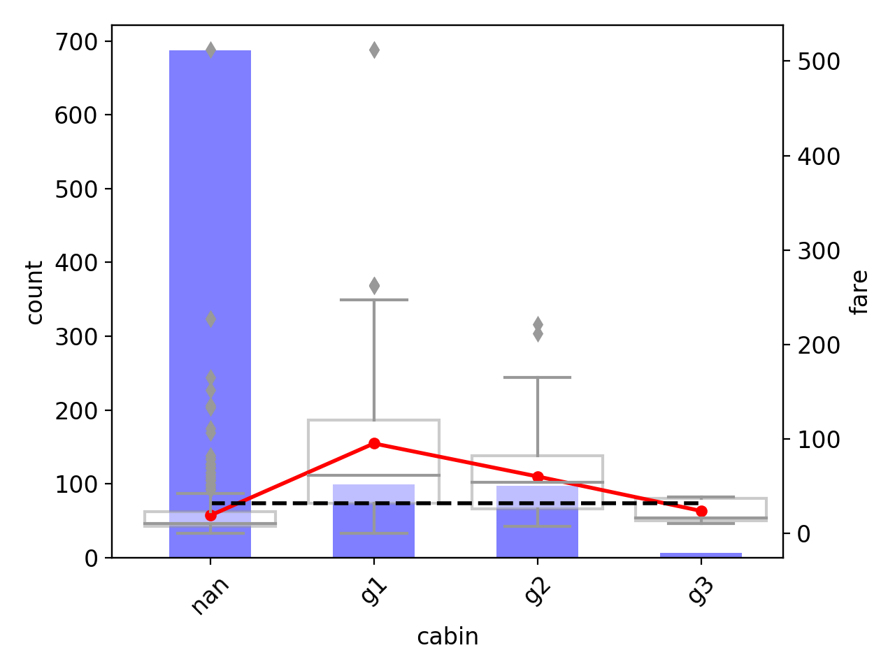

# tprojection

[![pypi] (https://img.shields.io/pypi/v/tprojection.svg)] (https://pypi.python.org/pypi/tprojection)

* Free software: MIT license

This library allows you to investigate the relation between a dependent variable and a predictor, irrepectively of their types (continuous vs categorical). This library is particularly useful
when both the dependent variable and the predictor are categorical. 

## Installation

    pip install tprojection

## Basic usage

     from tprojection import Tprojection

     tproj = Tprojection(df, "target", "predictor")
     tproj.plot()

## Advanced usage

You can find several examples of more advanced tprojection functionalities in `examples/examples.ipynb`

## Credits

This package was created with [Cookiecutter](https://github.com/audreyr/cookiecutter) and the [cookiecutter-pypackage](https://github.com/audreyr/cookiecutter-pypackage) project template.

