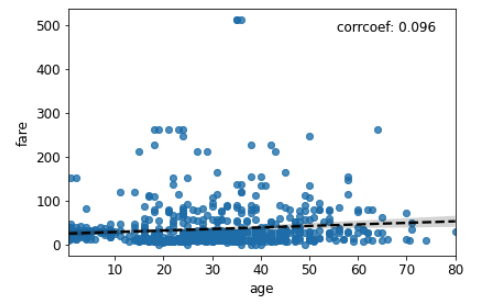

# tprojection

This library allows you to visually inspect the univariate relation between a dependent variable (the
target) and any feature in a meaningful way. This library is particularly convenient when the
target and/or the feature are categorical, ie when it is difficult to compute a traditionnal correlation coefficient.
And by the way, Tprojection stands for target projection.

## Installation

    pip install tprojection

## Basic usage

     from tprojection import Tprojection

     tproj = Tprojection(df, "target", "predictor")
     tproj.plot()

## Advanced usage

You can find several examples depicting more advanced functionalities in `examples/examples.ipynb`

## Documentation

Please find a light documentation [here](https://tprojection.readthedocs.io/en/latest/?)

## Credits

This package was created with [Cookiecutter](https://github.com/audreyr/cookiecutter) and the [cookiecutter-pypackage](https://github.com/audreyr/cookiecutter-pypackage) project template.

