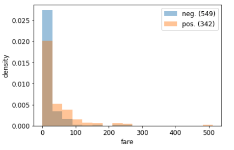

# tprojection

[![pypi] (https://img.shields.io/pypi/v/tprojection.svg)] (https://pypi.python.org/pypi/tprojection)

Tprojection stands for target projection. This library allows you to visually inspect the relation between a dependent variable (the target) and a predictor in a meaningful way. This library is particularly convenient when it is difficult to compute a traditionnal correlation coefficient, for instance when either the target or the predictor is categorical.
And by the way, Tprojection stands for target projection.

## Installation

    pip install tprojection

## Basic usage

     from tprojection import Tprojection

     tproj = Tprojection(df, "target", "predictor")
     tproj.plot()

## Advanced usage

You can find several examples of more advanced tprojection functionalities in `examples/examples.ipynb`

## Credits

This package was created with [Cookiecutter](https://github.com/audreyr/cookiecutter) and the [cookiecutter-pypackage](https://github.com/audreyr/cookiecutter-pypackage) project template.

